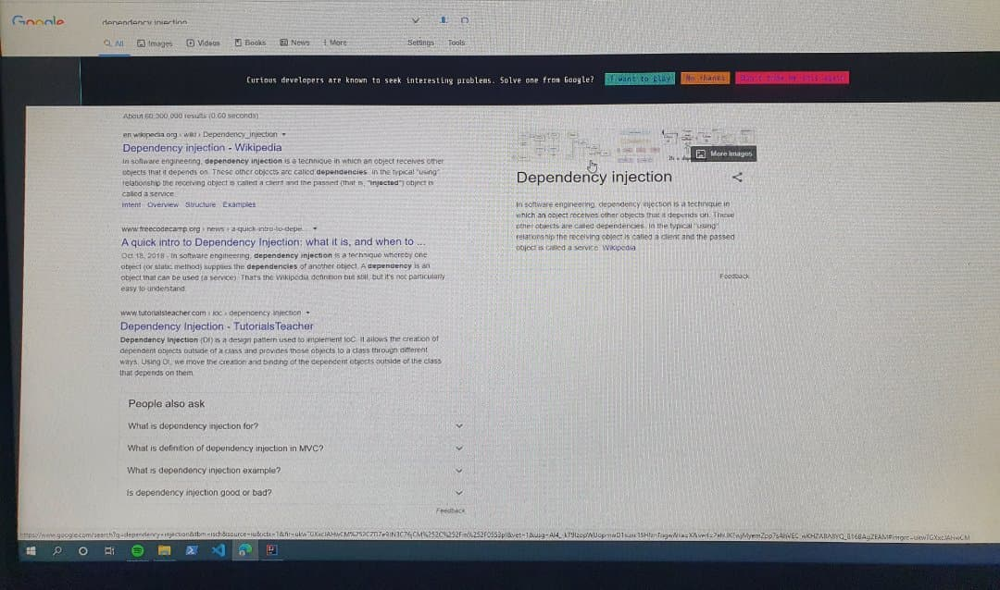
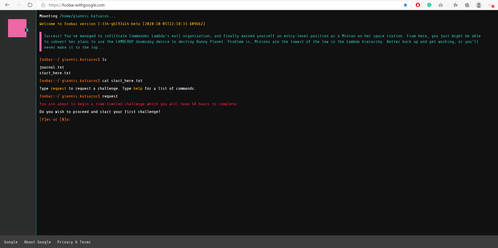
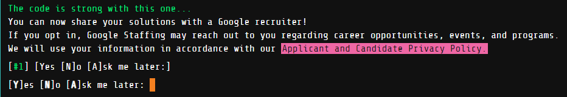
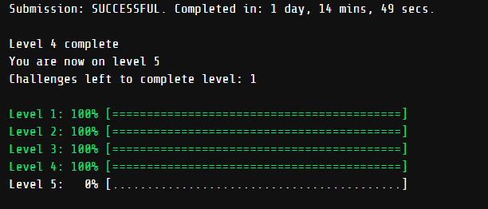
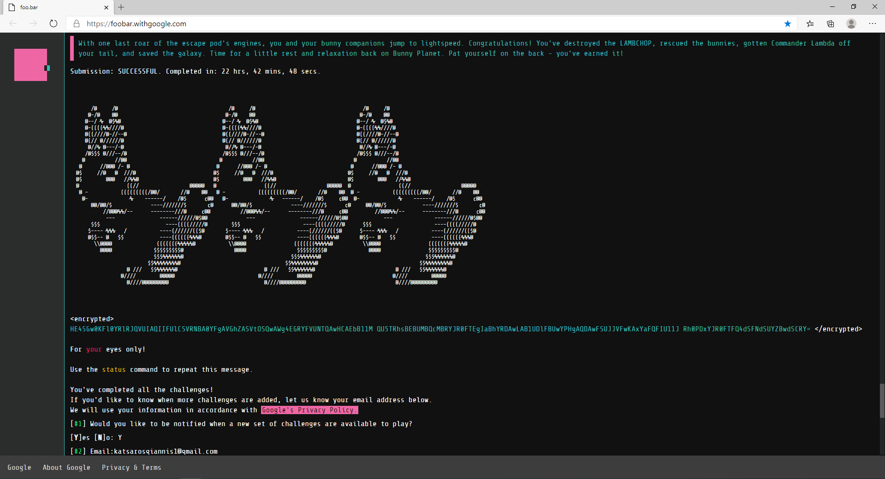
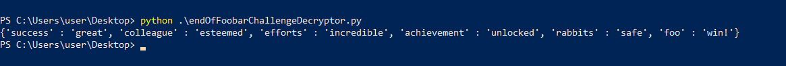

# Google FooBar Challenge
I participated in Google FooBar Challenge and I completed all 5 levels.

Link: [foobar.withgoogle.com](https://foobar.withgoogle.com/)

### What is Foobar Challenge?
Google Foobar is Google’s secret hiring challenge. 
Google uses this to hire some of the best developers around the globe which they think can be a good match for their organization. 
Once you accept the invite, you will be taken to a website in which you are given a question and a time limit and you have to finish the question within the limit or you fail.  
If you are able to solve the problem, you can request a new one and eventually move on to higher levels. 
But if you fail to complete a question, then you will no longer be able to request new problems.  
After you request the challenge you will receive some files and a question to solve. 
The question can be solved in either JAVA or Python. 
In total, you have **5 levels** and **9 questions** to solve.

### My Experience with the Google FooBar Challenge
The Google Foobar page is not accessible to everyone. 
Getting the invitation for Google Foobar is also a mysterious thing, no one exactly knows the criteria for the Google Foobar invitation eligibility. 
Google send the invitation on the basis of your search history and your problem solving related keyword searches. 
And based on Google search algorithms, they show you an invitation for Google Foobar. 

The invitation message reads like this: ***Curious developers are known to seek interesting problems. Solve one from Google?***

## Invitation

## First Screen

## Development
- All the solutions developed in Java 8+ by verifying and submitting the given file Solution.java, in every Foobar level/problem.
- The decryption script developed in Python, using "giannis.katsaros" as secret key for the base64 string.

## Status
##### Screenshot from FooBar CLI after passing level 3

##### Screenshot from FooBar CLI after passing level 4

##### Screenshot from FooBar CLI after passing level 5

## Encrypted/Decrypted Message

## More about the questions
The challenge had 5 levels, with each level having questions related to graphs and maths.

**Level 1** 
The first level was very similar to an interview question. 
You get 2 days to do it. I completed it quickly.

**Level 2** 
There are two questions at this level with the time of 72 hours to solve each question. 
Both the questions were based on the principles of linear algebra and mathematics.

**Level 3** 
The third level had 3 questions, with a time of 4 days for the first question and 7 days for the other two questions.
To solve these questions, it required a good knowledge of mathematics and programming concepts like dynamic programming, Markov’s chaining, etc.
After the 3rd level, I was asked to fill out my details for being contacted by a Google recruiter.
They ask your basic information: name, phone number, email address, country etc.

**Level 4** 
There are a total of two questions at this level and time of a total of 15 days is given to solve each question.
This level required the implementation of several concepts to solve a single problem. 
Extensive knowledge of algorithms and data structures is required at this level.
The questions were based on the concept of number theory and graphs.

**Level 5** 
The final level only had a single question and **22 days** were given to solve that problem, but I managed to solve it in **22 hours**.
The fifth level was purely mathematical. 
It was related to permutations, Beatty sequence, and the development of an implementation of exponentially decreasing complexity.

***With the submission of this question, the Google Foobar Challenge is completed!***

# Conclusion
I would say this is a great opportunity to learn and I would recommend you to solve the questions if you get an invitation. 
While solving the problems don’t keep your aim to get hired at Google but to learn the new techniques and experience one of the best coding challenges. And remember, 
**Foobar is more about learning and implementing, instead of knowing everything before!**  
If you have any questions, please contact me at [linkedin](https://www.linkedin.com/in/giannis-katsaros/).
