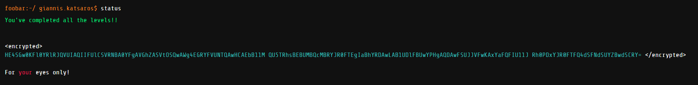

# Google Foobar Challenge
Participation in Google FooBar Challenge

Link: [foobar.withgoogle.com](https://foobar.withgoogle.com/)

## Invitation


## First Screen


## Development
```txt
- All the solutions developed in Java 8+ by verifying and submitting the given file Solution.java, in every Foobar level/problem.
- The decryption script developed in Python, using "giannis.katsaros" as secret key for the base64 string.
```

## Status
##### Screenshot after passing level 3

##### Screenshot from FooBar CLI after passing level 4

##### Screenshot from FooBar CLI after passing level 5


## Encrypted/Decrypted Message


